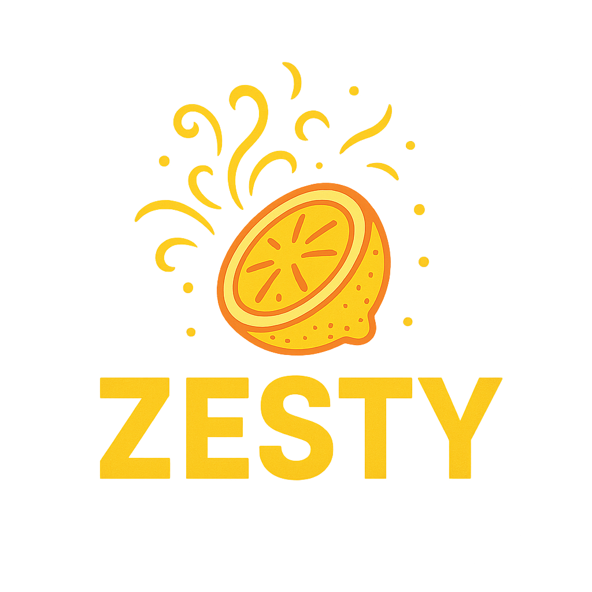
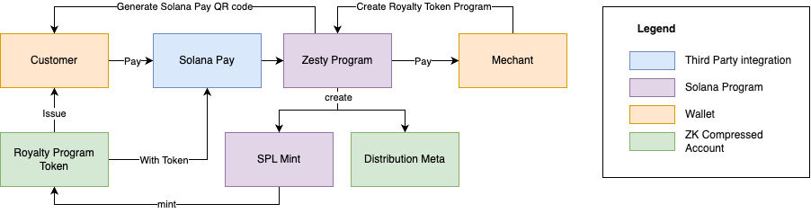

# Solana Pay with zkCompression POP Loyalty Token Claim
<div style="text-align: center;">

</div>

Welcome to the **Zesty* project! This open-source project leverages lightprotocol's zero-knowledge compression (zkCompression) to enable a seamless loyalty/experience token claim system integrated with Solana Pay. Our goal is to provide a scalable, cost-efficient, and user-friendly solution for businesses to reward customers with loyalty/experience tokens using the best and easiest solution on Solana.

## Overview

This project implements a loyalty token claim system on Solana, utilizing **Solana Pay** for frictionless payments and **zkCompression** for optimized on-chain storage. The **POP (Proof of Participation)** loyalty token incentivizes user engagement, enabling businesses to reward customers efficiently. Built with the **Anchor** framework and zkcompresion. 


Zesty will allow mechant/user to create compressed mint and set rules to distrbute loyalty or experience token based on the payment amount. Example for solana pay usecase, user can use zesty to create normal solana pay QR code and user can scan the code for both payment and receive loyalty token all at once. This is great for any point of sale (POS) system or remotely anywhere with QR code.

Whether you're a business looking to implement a loyalty program or a developer exploring Solana's capabilities, this project provides a solid foundation for building scalable applications on Solana.

## Features

- **Solana Pay Integration**: Streamlined payment flows for users to claim loyalty tokens.
- **zkCompression**: Reduces on-chain storage costs using zero-knowledge compression techniques.
- **POP Loyalty Tokens**: A flexible token system to reward user participation with customizable zkcompressed token mint.
- **Anchor Framework**: Simplified smart contract development with Rust and TypeScript support.
- **Open Source**: Community-driven development with opportunities for contributions.

## Getting Started

Follow these steps to set up and run the project locally.

### Prerequisites

Ensure you have the following installed:

- **Rust**: Install via `curl --proto '=https' --tlsv1.2 -sSf https://sh.rustup.rs | sh`
- **Solana CLI**: Install with `sh -c "$(curl -sSfL https://release.solana.com/stable/install)"`
- **Anchor**: Install using `cargo install --git https://github.com/coral-xyz/anchor anchor-cli --locked`
- **Node.js**: Version 20 or higher (recommended: `nvm install 20`)
- **Light Protocol Dependencies**: Install dependencies for zkCompression (refer to [Light Protocol Docs](https://lightprotocol.com/))
- **Git**: To clone the repository

### Installation

1. Clone the repository:
   ```bash
   git clone https://github.com/jimmdd/zesty.git
   cd zesty
   ```

2. Install JavaScript dependencies:
   ```bash
   yarn install
   ```

### Building the Project

Compile the Anchor smart contracts:

```bash
anchor build
```

This generates the program binaries in the `target/deploy` directory and updates the `Anchor.toml` configuration.

### Testing the Project

Run the test suite to verify the smart contracts:


1. **Run Light Test Validator**:
   If your tests require a local validator with Light Protocol support for zkCompression, start the Light test validator:

   ```bash
   light-test-validator
   ```


2. **Run Anchor Tests**:
    ```bash
    anchor test --skip-local-validator
    ```
   Ensure the validator is running before re-running `anchor test` if your tests depend on it.


This command executes the tests defined in the `tests/` directory without spinning up a local Solana validator, assuming a test validator is already running or tests are configured for a remote network.

### Directory Structure

```
├── programs/                # Anchor smart contracts (Rust)
├── tests/                  # Test scripts (TypeScript)
├── app/                    # Frontend or client-side code (if applicable)
├── migrations/             # Deployment scripts
├── Anchor.toml             # Anchor configuration
├── logo.png                # Project logo
└── README.md               # This file
```

## Contributing

Welcome contributions from the community! To contribute:

1. Fork the repository.
2. Create a new branch (`git checkout -b feature/your-feature`).
3. Commit your changes (`git commit -m "Add your feature"`).
4. Push to the branch (`git push origin feature/your-feature`).
5. Open a Pull Request.

## License

This project is licensed under the Apache 2.0License. See the [LICENSE](LICENSE) file for details.

## Contact

Have questions or ideas? Reach out to us:

- **GitHub Issues**: [Create an issue](https://github.com/jimmdd/zesty/issues)

Join our community and help shape the future of decentralized loyalty programs on Solana!

---

Built with 💜 by Jimmdd